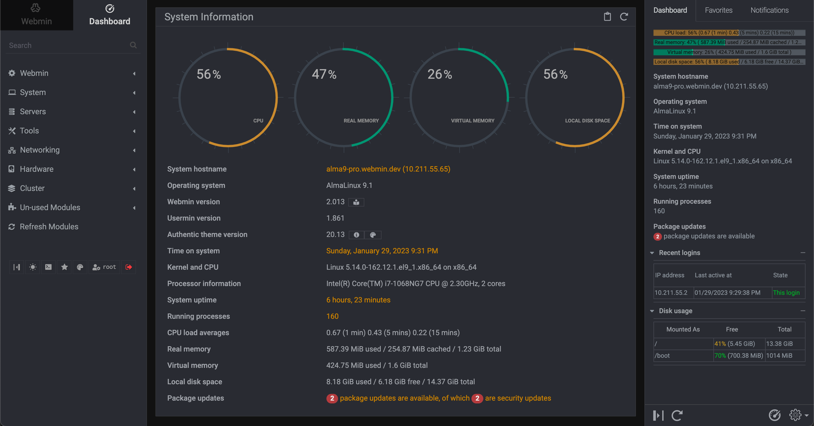

<!--
To README zostało automatycznie wygenerowane przez <https://github.com/YunoHost/apps/tree/master/tools/readme_generator>
Nie powinno być ono edytowane ręcznie.
-->

# Webmin dla YunoHost

[](https://ci-apps.yunohost.org/ci/apps/webmin/)


[](https://install-app.yunohost.org/?app=webmin)

*[Przeczytaj plik README w innym języku.](./ALL_README.md)*

> *Ta aplikacja pozwala na szybką i prostą instalację Webmin na serwerze YunoHost.*  
> *Jeżeli nie masz YunoHost zapoznaj się z [poradnikiem](https://yunohost.org/install) instalacji.*

## Przegląd

Webmin is a web-based interface for system administration for Unix. Using any modern web browser, you can setup user accounts, Apache, DNS, file sharing and much more. Webmin removes the need to manually edit Unix configuration files like `/etc/passwd`, and lets you manage a system from the console or remotely.

**Dostarczona wersja:** 2.301~ynh1

## Zrzuty ekranu



## Dokumentacja i zasoby

- Oficjalna strona aplikacji: <http://www.webmin.com>
- Repozytorium z kodem źródłowym: <https://github.com/webmin/webmin>
- Sklep YunoHost: <https://apps.yunohost.org/app/webmin>
- Zgłaszanie błędów: <https://github.com/YunoHost-Apps/webmin_ynh/issues>

## Informacje od twórców

Wyślij swój pull request do [gałęzi `testing`](https://github.com/YunoHost-Apps/webmin_ynh/tree/testing).

Aby wypróbować gałąź `testing` postępuj zgodnie z instrukcjami:

```bash
sudo yunohost app install https://github.com/YunoHost-Apps/webmin_ynh/tree/testing --debug
lub
sudo yunohost app upgrade webmin -u https://github.com/YunoHost-Apps/webmin_ynh/tree/testing --debug
```

**Więcej informacji o tworzeniu paczek aplikacji:** <https://yunohost.org/packaging_apps>
